# Case Study 001 - ARP Behavior
**Date:** `2025-10-20`    
**Analyst:** Huynh Thanh Tu  
**Repo:** `Network_Lab-Analyst-Wireshark-/001_ARP_Behaviors_Analysis`
---

## 1. Objective  
- [x] Learn the real-world behavior of ARP and network devices through Wireshark by capturing packets on a real-world network model.
- [x] Find out the reason for the reaction between Kali and the router after deleting the entire ARP table Kali still has the phenomenon of relearning the gateway's MAC.  
---  

- **Wireshark capture file:** [Download PCAP](pcaps/001_ARP_Flush.pcap)
  
---  

## 2. Environment Setup  

| Component | Describe |
|---------|--------|  
| Gateway | 192.168.1.1 (via DHCP) |  
| Host Machine | Window 11 (DHCP) - IP: 192.168.1.213 |  
| Host Network | Wi-Fi connected to router 192.168.1.1 |
| Virtual Machine | Kali Linux 2025 (Virtual Box) - IP: 192.168.1.195 (Static IP) |  
| VM Network | Bridged to host Wifi Adapter |  
| Target Device | Android Phone (DHCP - Same Network) - IP: 192.168.1.172 |  
| Tool | `Wireshark` |  
---  
  
## 5.1. Test objectives

- ```Test 1```: Ping 8.8.8.8 — check ARP with default gateway under normal conditions.  
- ```Test 2```: Ping Windows host — check ARP in internal network.  
- ```Test 3```: Ping phone (WiFi on same network).  
- ```Test 4```: Turn phone WiFi on/off — see router's reaction to device status changes.  
- ```Test 5```: Clear ARP table and ping again — observe router's "self-learning" mechanism.  

## 5.2  Methodology and Analysis  
  ### Test 1: ```Ping 8.8.8.8```    
  #### Steps:  
   1. Start capture with port `eth1`  
      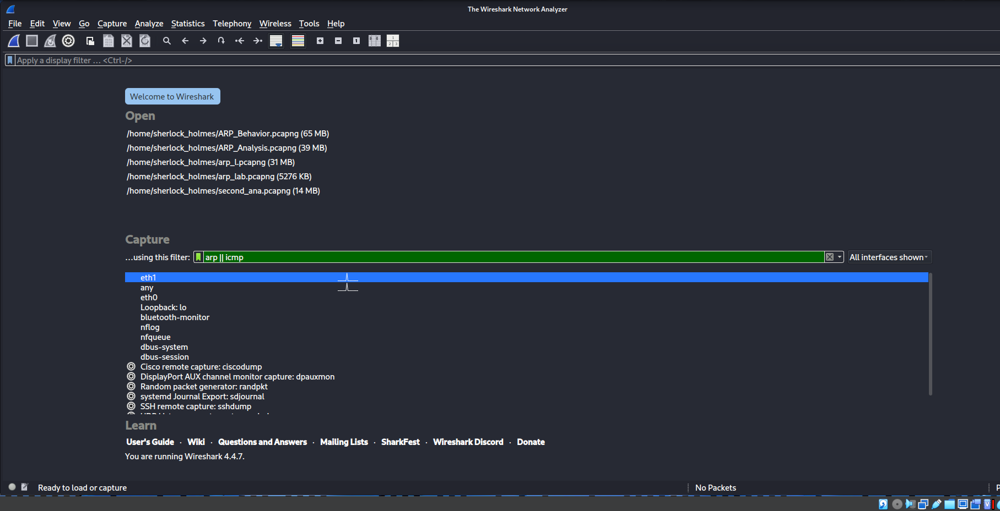
   2. Check again about ip of device to ensure everything still work.  
      - Configure of Host Machine  
        
      - Configure of Kali Linux    
        
      - Target Device  
      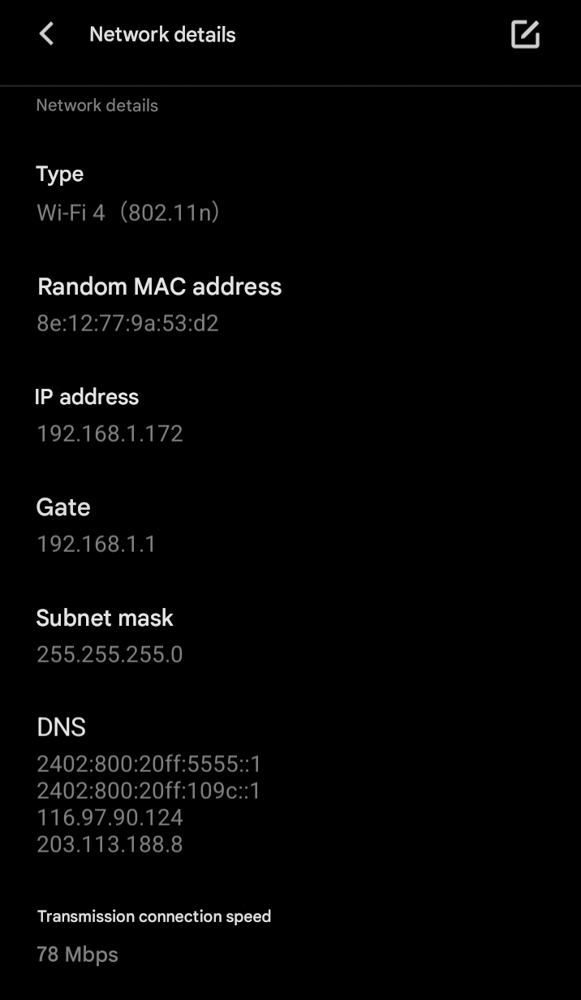  
   3. Check ARP Table on Kali Linux `arp -a` 
        
   4. Ping ```8.8.8.8```  
  
---

  #### Observations 
   - Before Ping
      - After starting Kali , on wireshark can be seen Kali actively sends an ARP request packet broadcast to the entire network to find the gateway.
      - ARP Request packet broadcast from ```PCSSystemtec_ed:08:70``` (Kali Linux) (frame ```534```).
      -  ```zte_4a:0e:d0``` Router sendback it MAC through ARP Reply packet to ```PCSSystemtec_ed:08:70``` answer the ARP Request(frame ```535```).   
      -  Then, Router send 1 ARP Request to Kali to ask what is it MAC (frame ```543```).
      -  Kali feedback it MAC for Router (frame ```544```).
      - Use ```arp -a``` to check ARP Table appear the strange mapping.  
   - During Ping
      - The first 5 ICMP Request packets did not receive any replies (from frame ```643``` to frame ```730```).
      - One more time Kali and Router exchange MAC with each other (frame ```758 and 759``` ).
      - 5 ICMP request packets sent from Kali (```192.168.1.195```) to ````8.8.8.8```.  
      - 5 ICMP reply packets sent from ```8.8.8.8``` turn back Kali.  
   - After Ping
      - Once again, the Router actively sends an ARP Request to Kali to ask for the MAC (frame ```841``` and frame ```842```).  

---

  #### Result
   - Ping to ```8.8.8.8``` successful, 5/10 pack response (from frame ```760``` to frame ```775```), ```50%``` packet lost, time  ```9128ms```.   
   - 5 Packet (from frame ```643``` to frame ```730```) no response found!. 
     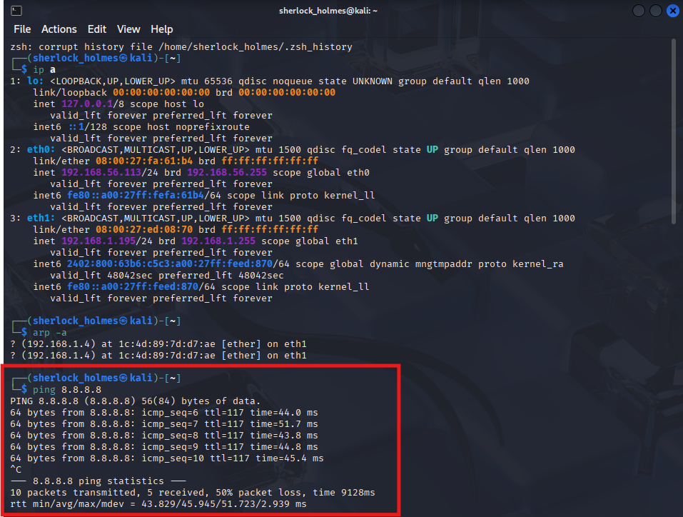
   - The ARP table after ping contains only gateway entries.  
  
---  

  #### Analysis
 - [x] In the first five ICMP requests, no replies were received. This happened because the router did not have the correct MAC address of the Kali VM in its ARP table. Therefore, the packets were dropped until the router updated its ARP entry after receiving the ARP request from Kali.
  
---

  #### Explanation  

> **Normally**, When a device is back online after a long time or simply restarted, a new Network activity is created.  
> At this time, Kali's Kernel automatically ensures the availability of the default route by ARP refreshing the gateway (`192.168.1.1`), even if traffic does not pass through it.  
> → That's why we see Kali actively sending ARP Request to ask for the Router's MAC (frame `534`).  
  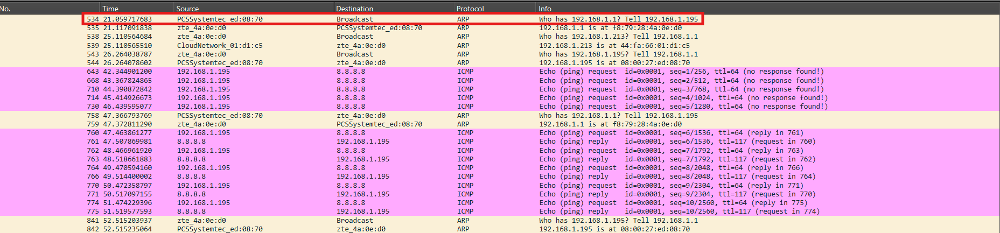

---

> **Next**, we can easily see in the Observations section that it is mentioned that after Kali sends a request to get the router's MAC.  
> After replying and giving its MAC to Kali, the router usually sends back an ARP Request packet to ask for Kali's MAC
  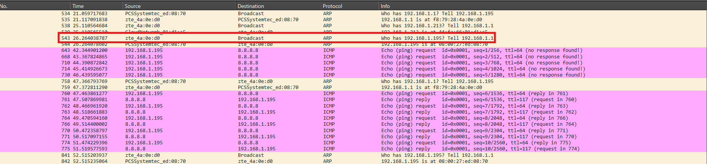
> So what does it mean?  

Before answering that question, we will delve into the Router's working mechanism a bit.  
The Router only proactively asks for the MAC of a device in **3 cases**:

1. **Entry in the ARP table expires:**  
   Each entry in the ARP cache can only live for a certain period of time depending on the configuration,  
   but if it expires and the router still needs to send a packet to that IP → it must ask again to get a new MAC.

2. **Device does not respond / shows signs of `Death`:**  
   If the router sends a packet to the old MAC but does not see a response (ICMP unreachable, TCP does not ack, etc.) →  
   it suspects that entry is "dead" and asks again for a new MAC to verify.

3. **New device rejoins the network or IP/MAC changes:**  
   When a device disconnects Wi-Fi and reconnects, it may change the MAC (randomized MAC) →  
   the router sees the old IP but the MAC is different → the router asks again "who is holding this IP?" to update.

---

But there is still another case that many network devices, even modern routers, have, which is **ARP Verification**,  
which means when a device sends a Request to ask for the MAC of the device, the device will of course respond to that invitation,  
but even though the device is fully capable of updating the MAC of the target device sending the request through the available information from the ARP Request Header sent
  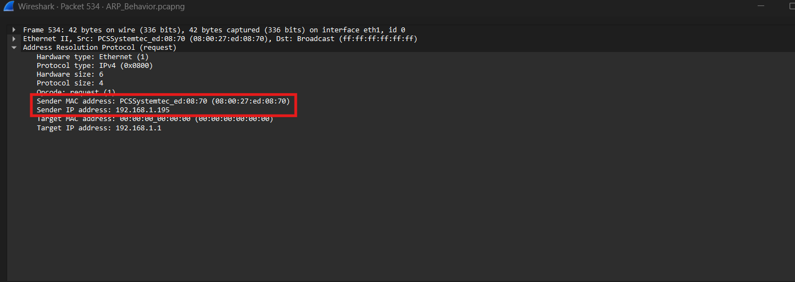
It does not choose to do so, but it will send back an ARP request packet with the purpose of confirming whether that IP has that MAC?  

Enhanced security especially against ARP Spoofing to ensure that the source IP/MAC actually exists on the network  
before accepting it and saving it to the ARP table.

→ That's why we often see that even though Kali has sent a request and asked for the Router's MAC,  
the Router still only temporarily trusts it if it is in the ICMP Echo process, as we see it will temporarily forward the ICMP packets through  
but after finishing it will specify that IP and ask for the MAC again using ARP.

---

According to the ARP mechanism, when a device sends an ICMP packet to another IP,  
it must first know the corresponding MAC address.  
If the ARP cache entry is outdated or incorrect, the device will not be able to send the ICMP packet successfully.  

In the pcap above, we see that the first 5 ICMP packets do not have any response corresponding to the requests.  
  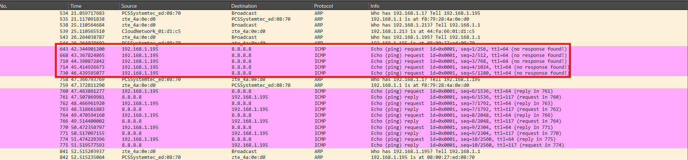
To explain this problem, there are 2 possible reasons that can be given:  
either Kali or Router does not have the opponent's MAC for ICMP to work properly,  
and I can be sure that in this case the error lies with the router.

We can easily determine the cause by trying to open an ICMP request packet, let's say I open frame `643`:  

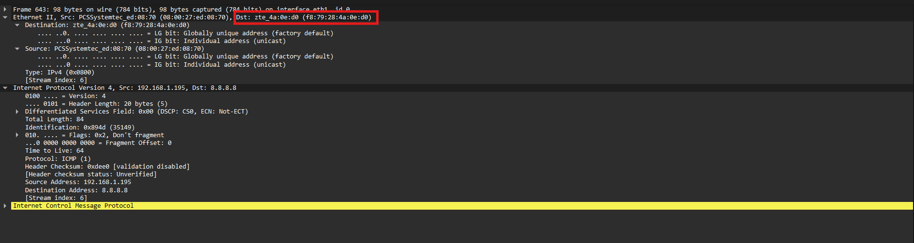  

We can see a lot of information, but if we are a little observant, we can easily see that the destination MAC is of `zte_4a:0e:d0`,  
which means the router, and the request packet will only be displayed if it is actually sent out to the network traffic,  
and Wireshark can only capture packets at the low layer (driver), so we can see the ARP reply as soon as it passes through the NIC.  

The kernel has not yet recorded/marked that entry as usable, so the first few ICMP packets are still dropped in theory,  
but we can clearly see the request packets displayed, but there are no response packets returned,  
so we can conclude that the problem lies with the Router.  

---

There will be a question like:  
if it is really the Router, but isn't it a bit unreasonable because from the beginning, Kali and the Router have clearly had a 2-way MAC exchange with each other?  

In theory it is correct but in practice there are a few other variables that affect the actual result,  
suppose Kali and Router have already got each other's MAC but in this case I ran the program quite early after that process — probably only a few seconds —  
so it is very possible that the Router has not yet finished updating its ARP cache,  
it may be stopped somewhere at the duplicate check, or some factors such as network congestion  
even though the response is displayed on Wireshark but it may not have reached the router yet,  
causing the ARP table update process to be delayed and then I run ICMP,  
and of course because there is no correct Mapping in the cache,  
the Router will leave the packets in the queue for quite a long time and there is also a rate of these packets expiring before sending to `8.8.8.8`.

---

As for the cause, there may be many reasons but the problem is definitely in the Router and not Kali as you can see.

---  

  ### Test 2: ```Ping Windows host```
  #### Steps:  
   1. ping ```192.168.1.213``` (IP Host Window – Name: ```CloudNetwork_01:d1:c5```).
   2. ```arp -a``` (check ARP Cache of Kali Linux after ping Host Window).

---  
 
  #### Observations 
   - During Ping 
     - Kali sends ARP request packet asking for Window's MAC (frame ```1191```).
     - Reply from ```CloudNetwork_01:d1:c5``` (Window) to ```PCSSystemtec_ed:08:70``` (Kali Linux) (frame ```1192```).
       
     - The first ICMP packet is sent from IP ```192.168.1.195``` (Kali) to the host ```192.168.1.213``` (frame ```1193```).
     - Reply from host send back to answer (frame ```1194```).
     - Gratuitous ARP appears from stranger MAC ```d6:6c:66:e1:e0:dd``` self-identify as IP: ```192.168.1.195``` (Duplicate IP detected notification appears) (frame ```1196```).
       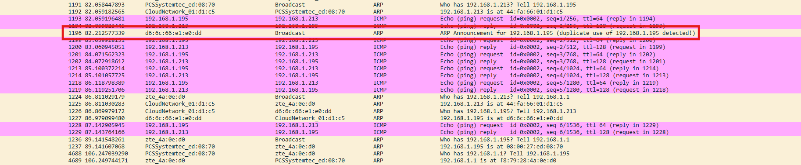
     - After that the next 4 ICMP packets are sent and then responded normally (from frame ```1199``` to frame ```1219```).
     - ```CloudNetwork_01:d1:c5``` (Window) send ARP Request to ```d6:6c:66:e1:e0:dd``` (```Strange Device```) to confirm its IP (frame ```1226``).
     - Reply from ```d6:6c:66:e1:e0:dd``` (```Strange Device```) to Host Window (frame ```1227```).
       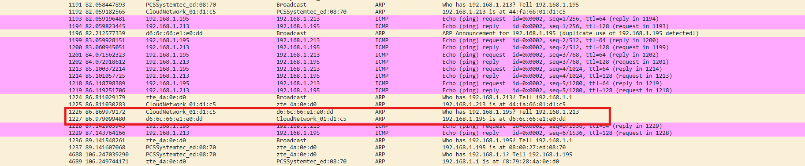
     - The ICMP process continues to the end (frame ```1228``` to frame ```1229```).
   - After Ping
      - In Wireshark
        - Router and Kali have a short ARP conversation to update each other's ARP cache (from frame ```1236``` to frame ```4689```).
          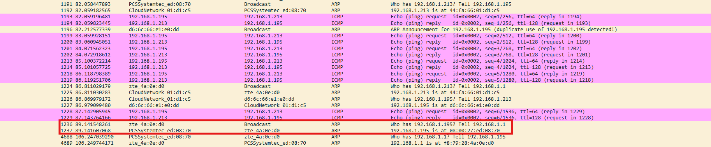
      - In Kali Linux Shell
        - After ICMP testing, Kali recorded 1/6 packets sent in response, time ```5082ms```.  
  
---
 
  #### Result
   - 1/6 pack response (from frame ```1193``` to frame ```1194```), ```83.3333%``` packet lost, time  ```5082ms```.  
     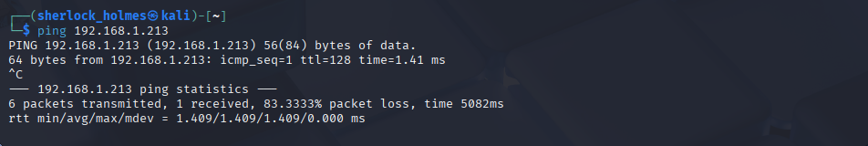 
   - The remaining 5 ICMP Packets (from frame ```1199``` to frame ```1219```) have full ICMP Request and Reply but are not recorded on Kali Linux.
   - ARP Cache of Kali updated mapping with IP: ```192.168.1.213```.  
  
---  

  #### Analysis
  - [x] Of the 5 ICMP packets sent, only 1 was recorded by Kali's Kernel. This indicates that during the signal checking process between the 2 Host Window and Kali devices, a device with an IP address that matches Kali's own IP appeared, breaking the logic of the entire process, causing the Replies that should have been sent to Kali to be sent to the device with the same IP. That is why Kali cannot see the packets returned after the IP duplication event appeared.  
  
---  

  #### Explanation
  > In theory, when two devices have sent each other the opponent's MAC (even if it's just an ARP Request), the entire ICMP process will still work normally(This was mentioned in ```Test 1```).  
  > Then the target device that was initially asked for ARP (Host Window) will ask again the MAC of the device that sent the ARP Request (Kali Linux) to update the ARP Cache to complete the ICMP process.  
  >  
  > But as we see, While Windows is pinging Kali a strange device appears on the network and sends a **Gratuitous ARP** claiming to be IP `192.168.1.195` (Kali's own IP) and immediately a warning **"(duplicate use of 192.168.1.195 detected!)"** is broadcast to the entire network.

  The Windows kernel receives that packet, and two things happen almost at the same time:

   1. It updates the ARP cache: `192.168.1.195 → MAC_Strange` (duplicate device).  
   2. It marks the old entry (`MAC_KALI`) as **"possibly stale / conflicted"**, and when it updates the ARP Cache again, of course the next packets will have the destination MAC of that strange device.  
   We can easily find that the destination MAC is no longer Kali's (Information of 1/5 packets was denied by Kali on Wireshark). 
   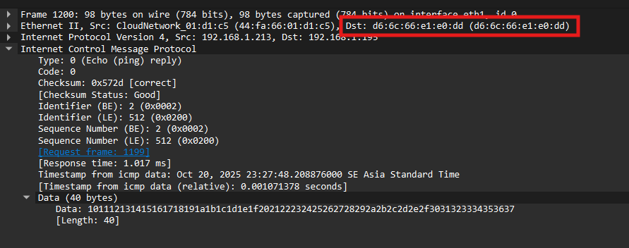

   > → This is enough to explain why the Kali kernel only receives **1 packet** during the entire ping process.

   ---

   If we put it in a more technical way. At that time, ICMP is still sending → the kernel is **"hesitant"**:

   - On the one hand, ICMP is opening a socket and there is a `ping.exe` process running.  
   - On the other hand, the network layer has just changed the MAC mapping information.

   When there is such a conflict, **Windows does not stop ICMP** (it still sends the request normally),  
   but it will proactively **ARP verify** the destination (`192.168.1.195`), asking:

   > Who has `192.168.1.195`? Tell `192.168.1.213` (frame `1226`) — even though it is in the middle of the ping process.

   

   → Because for the kernel, now that entry is **“suspicious”**,  
   so it asks again even when there is active traffic, to make sure it does not send the wrong data.

   Immediately, the strange device confirms with the Host that **it is the IP `192.168.1.195`** (even though Kali is the owner).  

   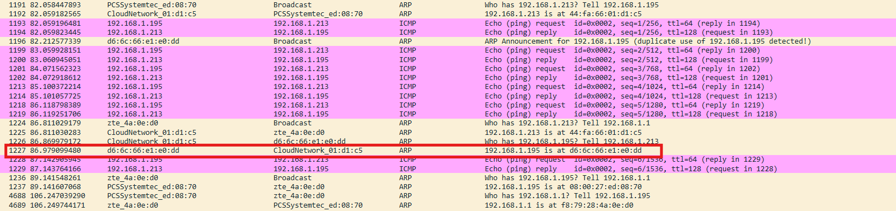

   Receiving confirmation immediately, the Host updates the ARP cache and sends a reply back as usual — but not to Kali anymore. 

   Finally, after ICMP ends, we receive a message that only **1/6 of the received packets** are successful (the rest are dropped).  

   ---

   > → This problem occurs because, as mentioned above, **Kali Linux is designed as a virtual device with a static IP**,  
   > so it is entirely possible that another device is assigned to the same IP that Kali is using.  
   >  
   > Since only one Gratuitous ARP was observed (not a continuous sequence),  
   > this behavior is attributed to **accidental IP duplication** rather than a deliberate **ARP spoofing attack**.

---  

  ### Test 3: ```Ping phone (WiFi on same network)```  
  #### Steps:
   1. ping ```192.168.1.172``` (IP Target Device (Android Phone) – MAC ```8e:12:77:9a:53:d2```).
   2. ```arp -a``` (check ARP Cache of Kali Linux after ping Host Window).

---  

  #### Observations 
   - During Ping 
      - Kali sends ARP request packet asking for Target MAC (frame ```6739``).
      - Reply from ```8e:12:77:9a:53:d2``` (Phone) to ```PCSSystemtec_ed:08:70``` (Kali Linux) (frame ```6741```).
      - Duplicate IP event appears from d6:6c:66:e1:e0:dd (frame ```6742```), claiming ```192.168.1.195``` (Kali’s IP).
        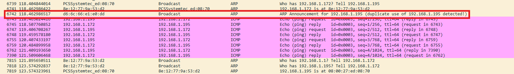
      - After that the next 4 ICMP packets are sent and then responded (from frame ```6743``` to frame ```7390```).
   - After Ping
      - In Wireshark
          - Target Device and Kali have a short ARP conversation to update each other's ARP cache (from frame ```7818``` to frame ```7819```).
      - In Kali Linux Shell
          - After ICMP testing, Kali recorded 4/4 packets sent in response.

---  

  #### Result
   - Ping to Target Device with IP ```192.168.1.172``` successful, 4/4 pack response (from frame ```6743``` to frame ```7390```), ```0%``` packet lost, time: ```3003ms```.   
   - ARP Cache updated with Target Device entry.
  
---  

  #### Analysis
  - [x] The duplicate IP message happens again, but because Phone delays ARP updates (doesn't update ARP Cache entry when there is Gratuitous ARP) it doesn't distort the ICMP traffic like Windows does. This explains why all pings are successful, unlike Test 2 where only 1/5 ICMP packets are received.
  
---  

  #### Explanation 
   > The core problem is the difference in ARP update policy between desktop and mobile devices
   - On Windows and most OS on PC/router ```ARP overwrite``` or ```gratuitous ARP acceptance``` Whenever an ARP announcement packet is received (even if it is not asked), it automatically updates the ARP cache if the IP is already in the table and does not care if the old entry is still valid or not.

   Suppose when a strange device sends a Gratuitous ARP pretending to be the IP: 192.168.1 .195, then Windows will immediately update the ARP Cache -> ICMP, TCP, UDP packets,... will immediately be sent to that MAC.
   - Mobile OS (Android, iOS, Linux kernel on embedded devices...) is much more cautious. If an entry already exists in the ARP cache and is still valid (not yet expired TTL), it does not automatically change the MAC just because it hears a Gratuitous ARP.
   * It only updates in 2 cases:
      - The entry expires TTL (usually 30–60s).
      - It sends an ARP request but receives a reply with a different MAC than the old one.  
  
   -> This explains why even after the IP duplication event occurs, the ICMP reply packets from Android Phone are still sent correctly to Kali.  

---  

  ### Test 4: ```Turn phone WiFi on/off — see router's reaction to device status changes```  
  #### Steps:
   1. Turn off Phone.
   2. Try ping ```192.168.1.172``` (IP Target Device (Android Phone) – MAC ```8e:12:77:9a:53:d2```).
   3. ```arp -a``` (check ARP Cache of Kali Linux after ping Phone) and see the difference.
   4. ping phone again.

---  

  #### Observations 
   - After turn off
      - Nothing happend.
   - After Ping
      - In Wireshark
        - 5 pack ICMP no respond found (from frame ```22572``` to frame ```22592```).
          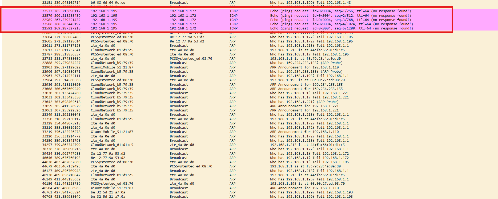
        - Kali unicasts continuously to seek response from Android Phone (from frame ```22602``` to frame ```22605```).
        - The router also starts sending out ARP packets to broadcast to find the Android Phone (recorded in frame ```32328```, frame ```33216``` and frame ```33220```).
          
      - In Kali Linux Shell
        - 0/5 packets were recorded as pinging successfully.
        - Noticed that Kali's ARP cache has changed when ```Incomplete``` status appears in Phone entry.
          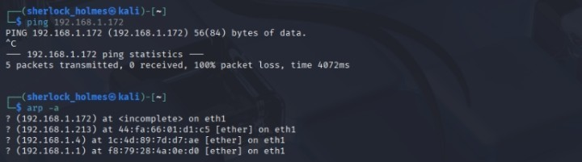
   - After turn on back of Phone
      - In Wireshark
        - Phone broadcasts to find Router (frame ```39424``` and frame ```40640```).
          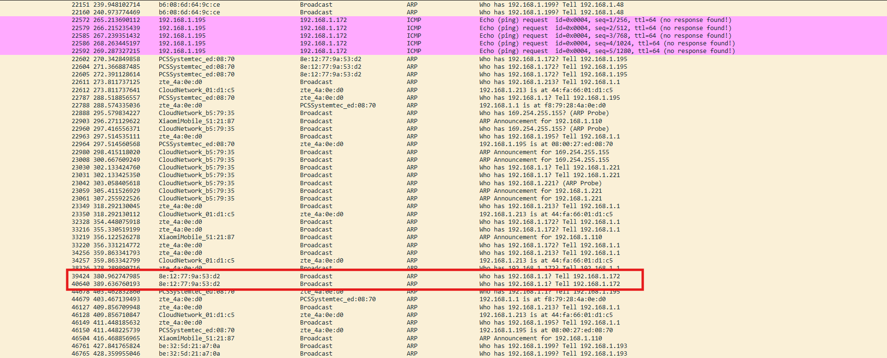
      - In Kali Linux Shell
        - Phone entry changed from incomplete to its own MAC. 
          
          
  
---

  #### Result
   - Ping to Target Device with IP ```192.168.1.172``` failed, 0/5 packet are received, ```100%``` packet lost with time ```4072ms```.
   - ARP Cache of Kali updated after connecting wifi to phone.
  
--- 

  #### Analysis
  - [x] After ping the device that has disconnected from Wifi, because no Host will reply back to Kali, the Phone entry on Kali will change state from having MAC to Incomplete to wait for a response from the Phone. When the connection is restored, Kali's ARP cache can update from any ARP broadcast packet in LAN that the OS receives (in this case, the first ARP Request packet that the Phone sends to the router), not necessarily from the ARP reply directly to Kali.   
  -> This explains why there is no traffic or broadcast that brings the Phone's MAC information to Kali, but Kali still automatically fills the Phone's MAC into its Cache. 
  
---

  #### Explanation 
   > In theory, when a device loses connection to the network for any reason, the router will take a while to realize (mainly waiting for the next ARP check session when the target device's entry expires). Then the router will broadcast continuously to find the target device and confirm that it still holds that IP before deleting the entry when the timeout / garbage collection time expires.  

   -> This explains why after the Target Device disconnects from the network, everything still goes on normally until frame `32328`, frame `33216`, and frame `33220` when the router realizes the absence of the Phone and broadcasts to search for a signal from it.  

   > Next, about Kali can update the Phone's entry by itself only thanks to the Phone's ARP Request to the Router related to the ARP cache update mechanism on Kali.  

   When the phone turns on Wi-Fi → it sends an ARP request to know the router's MAC:  
   **Who has 192.168.1.1? Tell 192.168.1.172**  

   -> This is an ARP request broadcast on LAN, so Kali can completely capture it thanks to Wireshark. Kali receives the ARP request, if the source IP of the request (`192.168.1.172`) matches the incomplete entry → Kali automatically updates the cache.  
   -> This is the standard mechanism of Linux/Windows.  
   -> This explains why Kali automatically fills in the MAC while there is no Gratuitous ARP packet appearing from the Phone or reply from other devices.

  
---

  ### Test 5: ```Clear ARP table and ping again```  
  #### Steps:
  1. Clear All ARP Cache ```sudo -s -s neigh flush all```.
  2. Check ARP Cache of Kali ```arp -a```.
  3. Try ping ```192.168.1.172``` (IP Target Device (Android Phone) – MAC ```8e:12:77:9a:53:d2```).
  4. Check ARP Cache of Kali Linux after ping Phone ```arp -a```  and see the difference.

---  

  #### Observations 
   - Before clear Cache
     - At the end of test 4 Kali's arp cache has all the entries from the previous tests: ````192.168.1.1```` from `Test 1`, ```192.168.1.213``` from `Test 2`, ```192.168.1.172``` in `Test 3` and `Test 4`.  
       
   - After Clear 
      - In Wireshark
          - Nothing Happend.
      - In Kali Linux Shell
          - Notification that entries in the Cache have been deleted.
           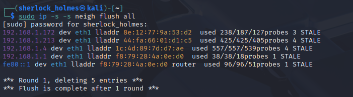
   - Show Arp Cache 
      - In Kali Linux Shell
        - ARP Cache of Kali is empty.  
           
   - During Ping
        - 2 ARP Request send from Kali to ask MAC ```192.168.1.172``` (frame ```49975``` and frame ```50041```).
        - Reply from Target Device to answer request (frame ```50044```).
        - 2 Echo ICMP Request from Kali send to Target Device (```192.168.1.172```) with no response found (frame ```50045``` and frame ```50046``` ).
          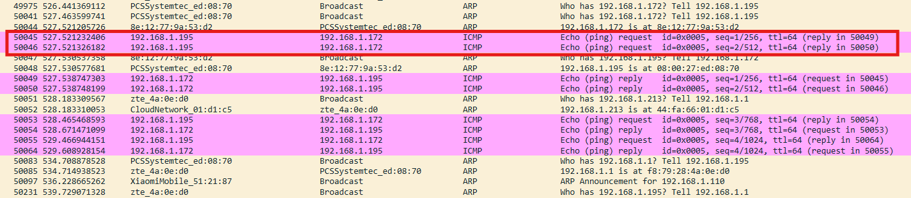
        - ARP Request from device has MAC ```8e:12:77:9a:53:d2``` send to Kali and reply from Kali(frame ```50047``` to frame ```50048``` ).
        - 2 replies from ```192.168.1.172``` sent to Kali (frame ```50049``` and frame ```50050```) and marked as replies to requests in frame ```50045``` and frame ```50046```.
           
        - Requests and replies are sent synchronously until the ICMP process ends (from frame ```50053``` to frame ```50064```).
   - After Ping
      - In Wireshark
          - Everything goes normally, packets are exchanged back and forth but it is just a process of updating the ARP Cache between devices when the entry expires.
            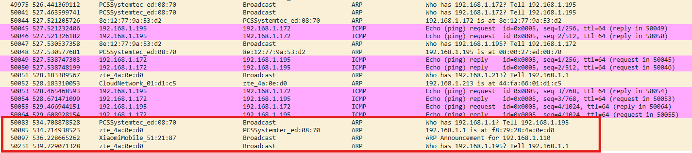
      - In Kali Linux Shell
          - 4/4 packet received -> Ping Successful.
   - Arp Cache after ping
        - Two entries appear: ```192.168.1.172``` (Target Device - Android Phone) and ```192.168.1.1``` (Router).
          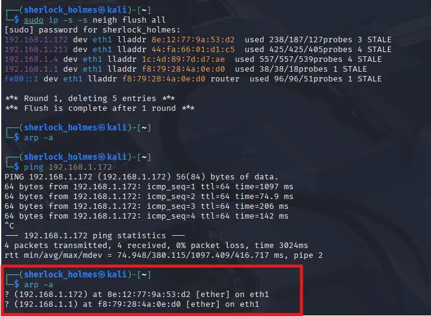
  
---  

  #### Result
   - Ping to Target Device with IP ```192.168.1.172``` Successful, 4/4 packet are received, ```0%``` packet lost with time ```3024ms```.
   - ARP Cache of Kali updated entry of Phone and router after ping process.
  
---  

  #### Analysis
   - [x] When the Phone interface was just turned back on (after disconnecting the wifi connection not long before in ```Test 4```) its entire ARP Cache was cleared and the Phone's behavior changed afterwards, so when a request was sent from Kali, it did not respond immediately but had to send back an ARP Request to ask for the Kali MAC and then return the corresponding replies.
   - [x] Even when there is no traffic through the route, the Kernel still automatically verifies the "default route", when there is ICMP activity or routing check, the kernel automatically sends an ARP request to ensure the route is valid, even if it is not used at that time -> This explains why Kali's ARP Cache does not only have Phone entries.
  
---  

  #### Explanation 
   > In theory, network devices, especially Android, will have slightly unusual behavior right after being reconnected to the network for some security reasons. When the interface is just turned back on, Android temporarily does not trust any ARP entry received, unless:
   That packet is an ARP Reply reply to a Request it just sent, or that MAC matches the default gateway (to quickly restore the route). Therefore, when Kali sends an ARP Request asking for the Phone's MAC, it will not update the cache as usual at a temporary trust level and temporarily let traffic pass through and then check reliance with Kali after the ICMP process is complete, but it will keep all Kali's requests in a waiting state, then update Kali's MAC with the ARP Request it actively sent (frame ```50047``` to frame ```50048```) and then send back all replies to the number of suspended requests sent from Kali.
   > In essence, it is true that when 2 devices in the same LAN ping or send signals to each other, they will only be in unicast mode, meaning they do not need to use a router, but in this case, even though the traffic does not have a Router on it, its entry is still automatically updated in Kali's ARP Cache. It sounds mysterious, but we can analyze the possible possibilities that can happen:
   > - Case 1: The Router has an automatic broadcast mechanism to introduce its MAC (GARP) to the entire network after a period of time and Kali may accidentally catch it.
   > - Case 2: Kali has learned the Router's MAC indirectly through another packet when the Router replies to another device's ARP Request.  

   -> But these 2 possibilities were quickly rejected because from the beginning of the test until now, there has been no appearance of any Gratuitous ARP packets from the Router appearing on the network traffic as well as after many retests, this situation only appears when sending a signal to another machine, meaning there is traffic and when 2 devices send ARP Reply, it is always unicast so Kali cannot capture those packets at all and Wireshark is completely blind to the above packets.  
   - Maybe at this point you will think if I installed Wireshark incorrectly and only saw certain types of packets on the network traffic, making the observation of the packets no longer accurate and hasty conclusions?

  - That is a very good question but first I would like to briefly talk about a mechanism of Kali as well as many other network devices that also has that is ARP Learning, in short, Kali can learn the MAC of any device from all ARP packets received on the interface as long as they are valid (broadcast). We can easily test this function on Kali with the command:
    ```sudo sysctl net.ipv4.conf.all.arp_accept```
  -> The result can be 0 or 1
   - When ```arp_accept = 1``` (default)
   The kernel can learn MAC from every ARP packet received on the interface, including:
   Valid ARP reply from another host.
   Strange ARP request (only some cases Linux allows using the source MAC of the request to update).
   In other words, the source MAC that the kernel accepts is all ARP packets that go through the interface, as long as they have a valid IP.
   - When ```arp_accept = 0```
   The kernel does not automatically learn MAC from strange ARP packets.
   Only learn MAC in the following cases:
   The host itself sends ARP request and receives reply → MAC is updated.
   Any ARP packets from unknown sources or broadcasts will be ignored, not updated to the ARP cache → avoid “learning haphazardly”.
   Speaking of which, you probably understand what I mean, right? My Kali is in ```arp_accept = 0``` mode (you can verify it yourself  below)
     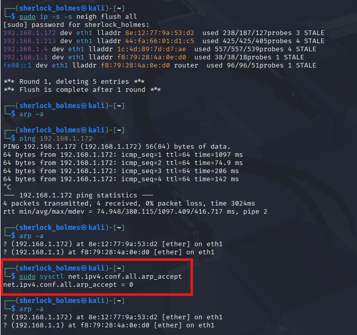

  - So back to the main issue, if all the above cases are not true, what did I miss? And then I suddenly realized when I looked back at the first packet Kali sent in ```Test 1``` and I went back to check my Default Route.  
     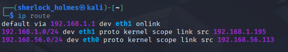
   > Even if not sending traffic through the router, the kernel still maintains the ARP entry of the default gateway (192.168.1.1) because
   Default route is onlink (meaning the kernel is forced to ensure it can reach the gateway if it needs to redirect).
   After flushing ARP, the kernel has not seen the MAC of the router → when there is ICMP activity or routing check, the kernel automatically sends an ARP request to ensure the route is valid. This behavior is the same as the behavior after just restarting Kali, it also defaults to sending an ARP Request to the Router to ensure the route is valid (frame ```534```).
   That entry only appears after the ping ends → coincides with the time when the kernel re-runs the neighbor discovery check for the default route.  

   -> This happens to ensure that important neighbors (gateway, DNS, DHCP server) always have a valid MAC in the cache.
  
---  

## 6. Conclusion

### 6.1 Overall Summary
 - Kali Linux and the router continuously exchange MAC addresses even when ICMP traffic does not pass through the router, because the kernel **automatically sends ARP requests to verify the default gateway**.  
 - Windows host updates ARP cache immediately when receiving a **Gratuitous ARP**, causing only 1/6 ICMP packets to be received during IP duplication.  
 - Android Phone does not automatically update its ARP cache upon receiving unknown ARP packets, so ICMP works fine, showing the **cautious ARP update policy on mobile OS**.  
 - After clearing ARP cache on Kali, ICMP ping still succeeds thanks to **ARP learning from broadcasts of router or target devices**.

### 6.2 Notable Observations and Lessons
 - [x] **Router ARP verification:** The router still sends ARP requests to verify Kali's MAC even after Kali sent a request, helping prevent ARP spoofing.  
 - [x] **IP duplication interrupts traffic:** 
      - Windows host quickly updates ARP cache to a stranger MAC → ICMP packets are dropped.
      - Contrary to OS Mobile devices, if an entry already exists in the ARP cache and is still valid, it will temporarily not update the MAC → ICMP packets still go to the right place.
 - [x] **Kali arp_accept=0/1:** Determines whether the kernel learns MAC from unknown ARP packets, explaining why Kali still learns the router's MAC without a direct reply.  
 - [x] **ARP cache refresh after reconnect:** Newly connected devices do not trust old MAC entries → kernel or router broadcasts to update ARP entries.
